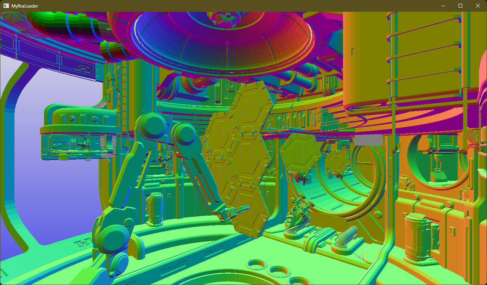

# RRA file Playground

## Introduction

Draws an RRA file using DXR. Currently, DXR 1.0 is used. Tested on Radeon 660M.



## Build

1. Build RRA
   Refer to [RRA's build instructions](https://github.com/GPUOpen-Tools/radeon_raytracing_analyzer/blob/main/BUILD.md)
   > Note: the CMakeFiles.txt assumes RRA's source tree is cloned to `%USERPROFILE%\Downloads\radeon_raytracing_analyzer`

2. Build RRA playground
   ```
   mkdir build
   cd build
   cmake ..
   msbuild rra_playground.sln /t:Build /p:Configuration=Release;Platform=x64
   ```

3. Run
   Double click `MyRRALoader.exe`